# General Purpose 8-bit Processor Design

A simple 8-bit processor design built in **VHDL** and tested in **Quartus II** on a Cyclone II FPGA target. The design uses input latches, a Moore finite state machine, a 4-to-16 decoder, an ALU, and 7-segment display output to cycle through a set of Boolean and arithmetic operations.

## Project Overview

This project was completed for COE328 Lab 6. The processor stores two 8-bit input values, steps through nine FSM states, decodes each state into a 16-bit microcode signal, and sends that microcode to the ALU to select the operation being performed.

The original lab inputs were based on the last four digits of a student number:

- `A = 0x26` → `0010 0110`
- `B = 0x44` → `0100 0100`

The ALU result is split into two 4-bit values and shown on two 7-segment displays. The design also displays the active student ID digit and, for Problem Set 3, whether each digit is odd or even.

## Features

- 8-bit latch-based input storage
- Moore FSM that cycles through nine states
- 4-to-16 decoder used as the ALU operation selector
- Three ALU versions for three problem sets
- 7-segment display output for results, signs, and student ID digits
- Quartus waveform simulations for each major module
- FPGA board verification using actual 7-segment display output

## Tools and Target

| Item | Details |
|---|---|
| Hardware target | Cyclone II `EP2C35F672C6` |
| HDL | VHDL |
| Design tool | Quartus II |
| Verification | Quartus waveform simulation and FPGA board testing |
| Main outputs | 7-segment displays and FPGA board LEDs |

## System Architecture

The processor is built from the following modules:

| Module | Purpose |
|---|---|
| `latch` / `latch_unit` | Stores the 8-bit input values before they are sent to the ALU. |
| `fsm` / `machine` | Cycles through the student ID states and provides the current state. |
| `4x16decoder` | Converts the 4-bit FSM state into a 16-bit one-hot operation code. |
| `alu` / `moddedALU` / `part3Alu` | Performs the selected Boolean, arithmetic, or odd/even operation. |
| `modded_sseg` / `sseg` | Converts values into 7-segment display format. |
| `Block*.bdf` | Top-level block diagrams connecting the processor modules. |

## Project Structure

```text
GeneralPurpose8-BitProcessorDesign/
├── Part 1/
│   ├── Part1.qpf
│   ├── moore_machine.qsf
│   ├── part1.bdf
│   ├── alu.vhd
│   ├── moddedALU.vhd
│   ├── latch.vhd
│   ├── latch_unit.vhd
│   ├── fsm.vhd
│   ├── 4x16decoder.vhd
│   ├── modded_sseg.vhd
│   └── output_files/
│
├── Part 2/
│   ├── Part2.qpf
│   ├── moddedALU.qsf
│   ├── Block2.bdf
│   ├── *.bsf
│   └── output_files/
│
├── Part 3/
│   ├── Part3.qpf
│   ├── part3Alu.qsf
│   ├── Block3.bdf
│   ├── *.bsf
│   └── output_files/
│
├── General Purpose Processor Report.pdf
└── README.md
```

## Design Flow

1. The latch modules store the two 8-bit input values `A` and `B`.
2. The Moore FSM cycles through nine states.
3. The 4-to-16 decoder converts the current FSM state into a one-hot microcode signal.
4. The ALU reads `A`, `B`, and the active microcode bit.
5. The selected result is split into display values.
6. The 7-segment decoder shows the student digit, sign, and ALU output on the FPGA board.

## Component Verification

### Latch

The latch stores the input value when the clock is active and holds the previous output when the clock is inactive.

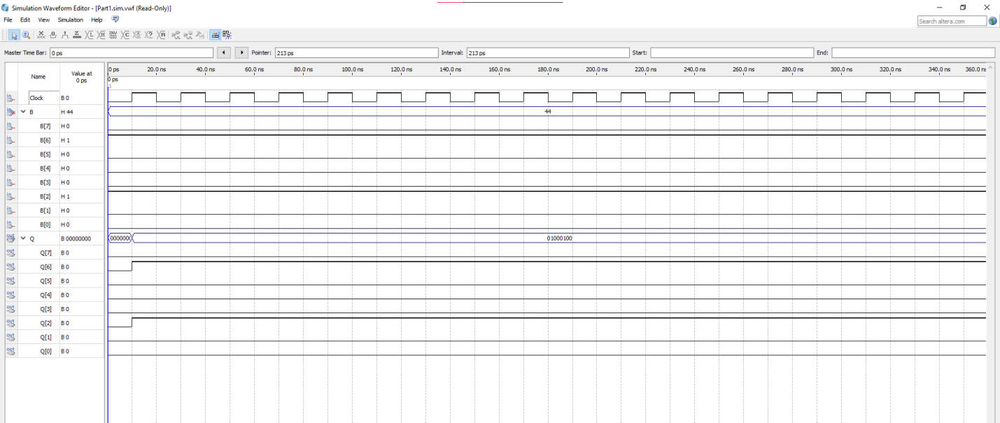

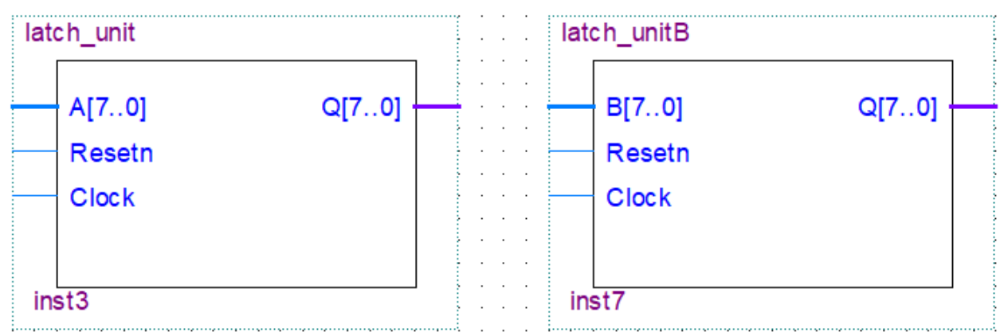

### Finite State Machine

The Moore FSM cycles through nine states and outputs the active student ID digit for each state.

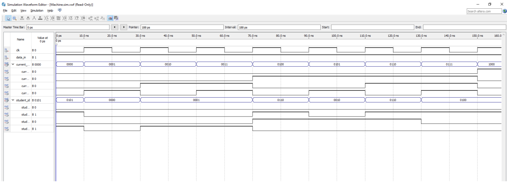

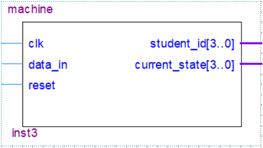

### 4-to-16 Decoder

The decoder converts the 4-bit FSM state into a 16-bit one-hot microcode signal. States 0 to 8 select valid ALU operations, while unused states output zero.

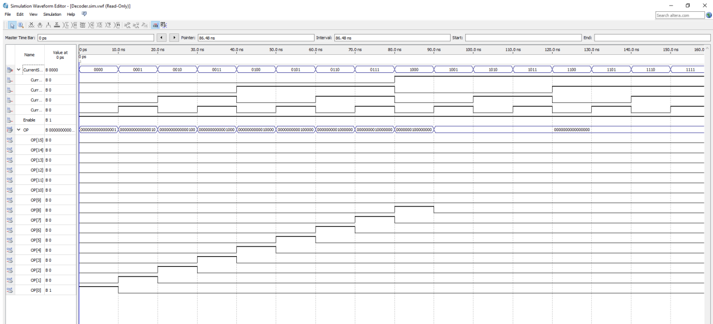

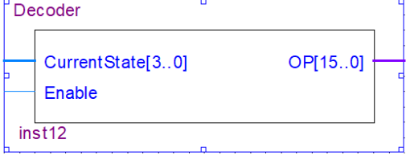

## Problem Set 1: ALU_1

ALU_1 performs the first set of Boolean operations on the 8-bit values `A` and `B`. The result is displayed using two 7-segment displays.


### ALU_1 Results

| Waveform simulation | FPGA board result |
|---|---|
| 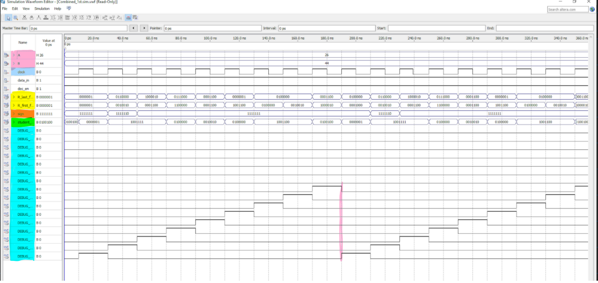 | 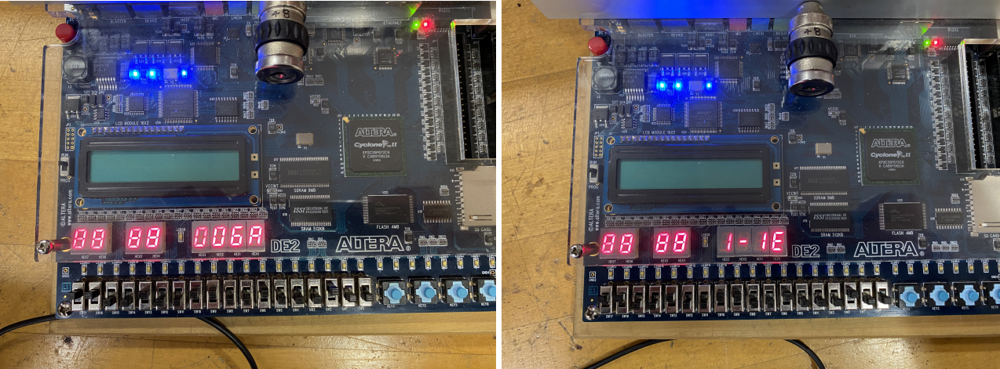 |

The waveform shows that the ALU operation lags one state behind the FSM and decoder. This happens because the FSM and ALU update on the same clock edge, so the decoded operation reaches the ALU after the ALU has already updated for that cycle.

## Problem Set 2: ALU_2

ALU_2 keeps the same processor structure but changes the operation set. This version includes operations such as incrementing `A`, shifting `B`, rotating bits, producing high or low bits, XOR, summation, and fixed high-bit output.


### ALU_2 Results

| Waveform simulation | FPGA board result |
|---|---|
| 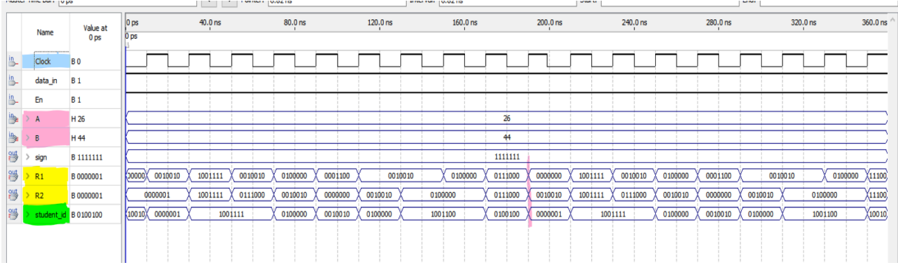 | 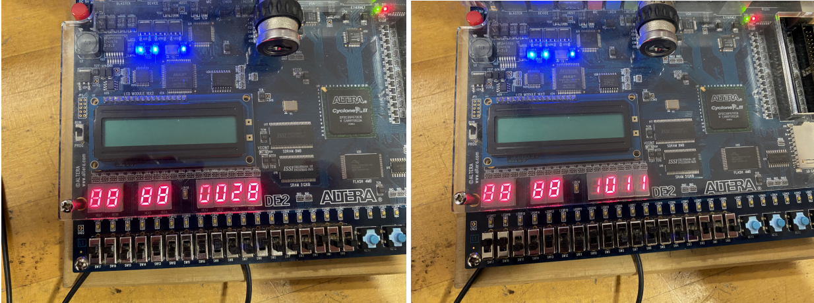 |

The same 7-segment display order is used: the student digit is shown on `HEX3`, the sign is shown on `HEX2`, and the two ALU result nibbles are shown on `HEX1` and `HEX0`.

## Problem Set 3: ALU_3

ALU_3 modifies the design so the ALU receives the 4-bit student ID digit from the FSM. Instead of displaying a full ALU result, it displays whether the current digit is odd or even:

- `y` = odd digit
- `n` = even digit


### ALU_3 Results

| Waveform simulation | FPGA board result |
|---|---|
| 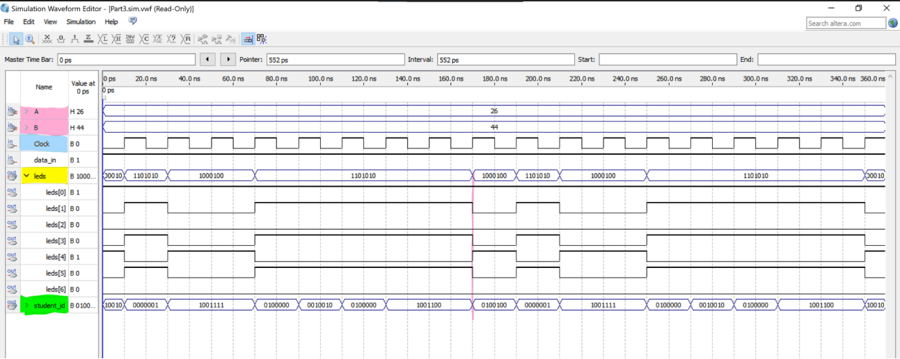 | 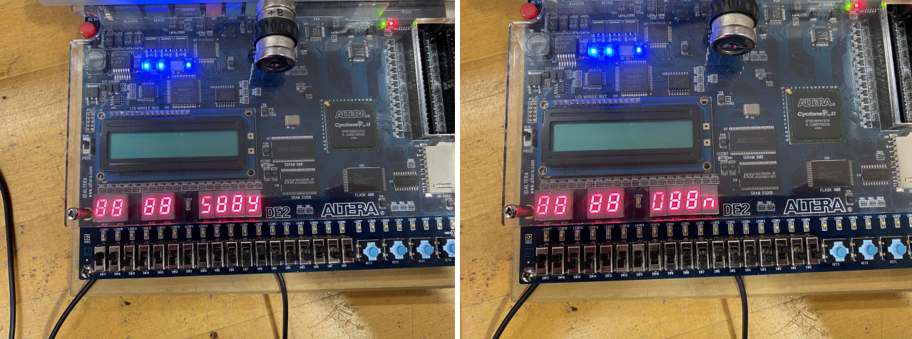 |

For this version, `HEX3` displays the current student digit and `HEX0` displays `y` or `n`.

## How to Run

1. Open the required Quartus project file:
   - `Part 1/Part1.qpf`
   - `Part 2/Part2.qpf`
   - `Part 3/Part3.qpf`
2. Check that all VHDL and block diagram files are included in the project.
3. Compile the design in Quartus II.
4. Program the FPGA using the generated `.sof` file from the `output_files` folder.
5. Use the waveform files or create a new waveform simulation to verify the FSM, decoder, and ALU outputs.

## Notes and Observations

- The 7-segment display output is inverted because of the FPGA board LED configuration.
- The ALU output in Problem Sets 1 and 2 lags behind the FSM state by one microcode step because both the FSM and ALU update on the same clock edge.
- The design can be improved by registering the decoder output or changing the clocking sequence so the ALU receives the selected operation before updating its result.

## Conclusion

This project demonstrates how a small processor can be built from simple digital logic blocks. The latch modules store inputs, the FSM and decoder generate operation control signals, and the ALU performs selected operations that are verified through waveform simulation and real FPGA board output.
